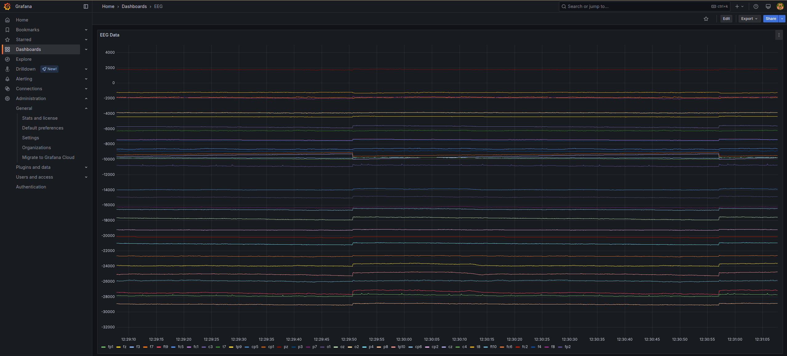

# EEG monitor - timeseries + LSL demonstrator
This is a simple compose project that receives EEG data from a [LSL stream](https://labstreaminglayer.org/#/) (type==eeg), writes that into a TimescaleDB database, which is then queried by Grafana to show the data feed live in a dashboard. It serves as an example, how to store data from LSL in a timeseries database and to visualize them. 

All components in this example are open source and thus feel encoraged to use them in your project. This software is mainly aimed at supporting research, however commercial use is possible - just respect [license](#license).

If you want to contribute more examples, please open a pull request.

## TL;DR
Run with mockup data:
```bash
  cd eeg-monitor
  docker compose --profile mock up
```

Just start receiver, database & Grafana:
```bash
  cd eeg-monitor
  docker compose up
```

Detailed instructions to run are described [below](#how-to-run).

## What does it do

Following screenshot shows Grafana displaying EEG data from Timescale DB. In this example, sample data are played in an endless loop. This shall demonstrate how to use the setup.



Setup runs the following components:
| Component       | Description                                        |
| ----------------| ---------------------------------------------------|
| Timescale DB    | Extension to the [PostgreSQL database](https://www.timescale.com/) system.|
| Grafana         | [Powerful visualization](https://grafana.com/) tool for all sort of data sources |
| [lsl-receiver](lsl-receiver/README.md)    | Connector to [LSL](https://labstreaminglayer.org) |
| [lsl-mock-stream](lsl-mock-stream/README.md) | Sample data source to send data to LSL            |

## How to run
This example uses [Docker compose](https://docs.docker.com/compose/) to start components and thus Docker needs to be installed on your computer. 

- Run `docker-compose up` to start the services. (`docker compose --profile mock up` if you want the sample data stream)
- Open your browser and go to `http://localhost:3000` to access Grafana.
  - If you want to edit the dashboard, you can log in with the admin user `admin` and password `admin`.

## Caveats
- This setup does not work using rootless Docker as the LSL stream is discovered using multicast, which is not trivially supported in rootless Docker.
- Timescale is configured to only keep a short window of data, so this setup should theoretically run forever.

# Thanks & Contribution
This is an open source project intended to stay open source. It shall help & inspire researchers to use open source. Any support is very much appreciated. You can contribute with the following support:
* File a bug report - use Github's issues, to report a bug
* Propose new functions/examples - create an issue describing your feature request
* Write bugfix - create a pull request

Contributors so far:
* [Dr. Nektaria Tagalidou]([https://www.iao.fraunhofer.de/de/forschung/beitrag_05-kontrollraum-fuer-die-ki.html](https://blog.iao.fraunhofer.de/author/nektaria-tagalidou/))
* [Michael Bui](https://www.iao.fraunhofer.de/de/forschung/beitrag_05-kontrollraum-fuer-die-ki.html)
* [Florian Stanek](https://github.com/flonix8)
* [Markus Zarbock](https://github.com/ztarbug)


## License
This software is licensed under AGPLv3 and license text can be found [here](LICENSE).

More info about Starwit can be found here: https://starwit-technologies.de/
